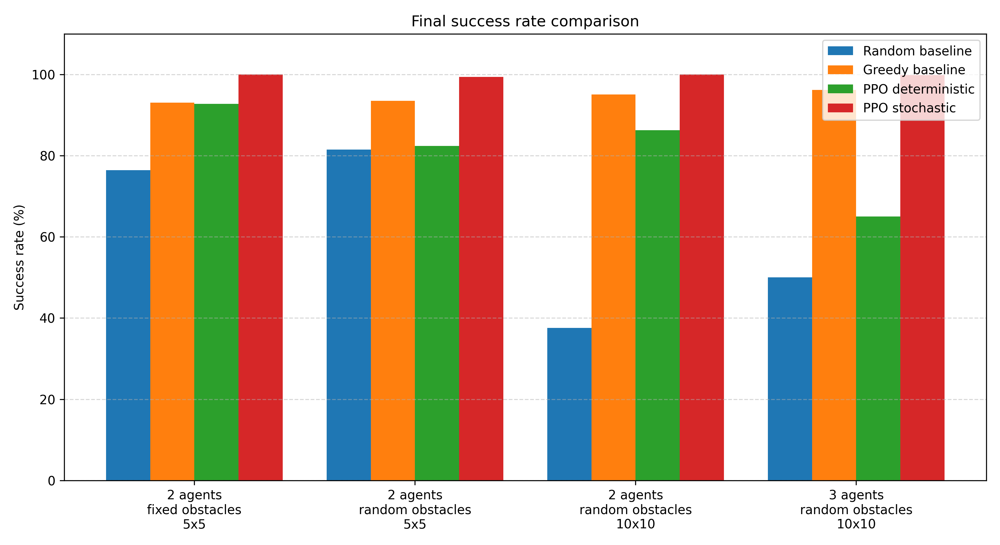
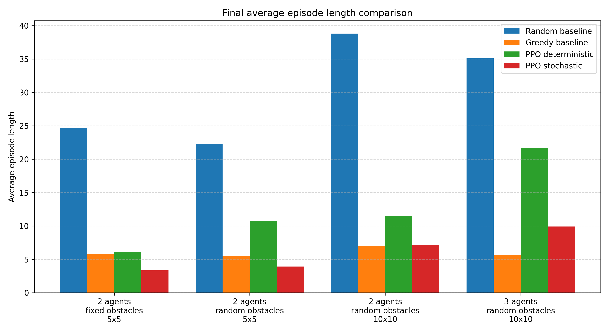
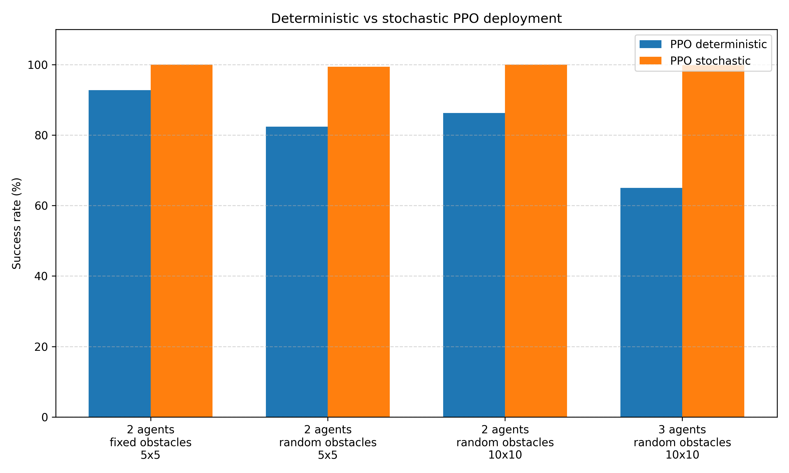
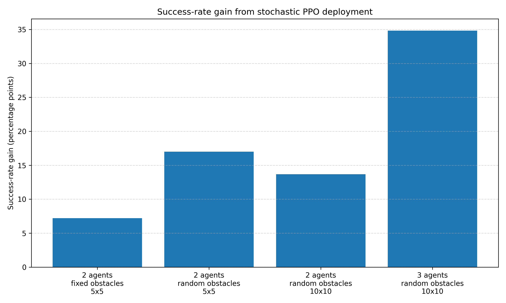
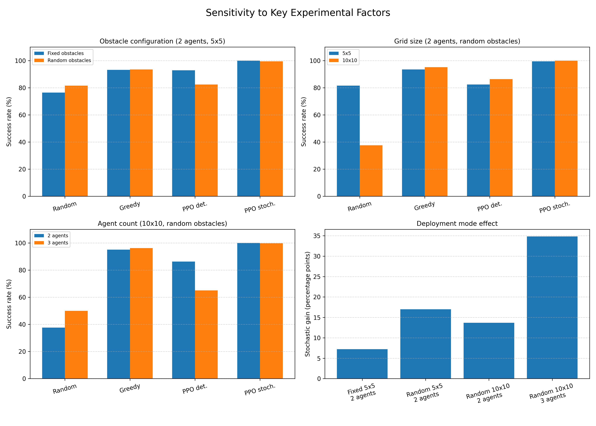

# Swarm RL Foraging

This repository contains a reinforcement-learning project for the BIO / AE4350 course. The project studies **swarm-inspired multi-agent foraging** in a custom 2D grid-world environment using Proximal Policy Optimization (PPO).

The work starts from a simple single-agent foraging task and progressively increases the environment complexity through grid-size generalization, fixed obstacles, randomized obstacles, centralized multi-agent control, and scalability from two to three agents.

The project is **swarm-inspired**, but it is not a fully decentralized swarm-intelligence system. The multi-agent experiments use a **centralized joint-action PPO controller**, where one policy selects a joint action for all agents.

## Project Goals

The main goals of the project are to investigate:

- how PPO performs compared with random and greedy baselines;
- how learned foraging behavior changes when obstacles are introduced;
- whether policies trained on smaller grids generalize to larger grids;
- how deterministic and stochastic PPO deployment differ;
- how centralized multi-agent PPO scales from two agents to three agents;
- how performance is affected by key experimental factors such as obstacles, grid size, agent count, and policy deployment mode;
- how swarm-inspired collective foraging can be studied in a controlled grid-world setting.


## Main Findings

The most important final findings are:

1. PPO clearly outperformed the random baseline in simple single-agent and multi-agent tasks.
2. Adding obstacle coordinates to the observation improved fixed-obstacle PPO performance, showing the importance of state representation.
3. Policies trained with randomized obstacles were more robust than policies trained only on fixed obstacle layouts.
4. Stochastic PPO deployment consistently outperformed deterministic PPO deployment in the most complex obstacle experiments.
5. Stochastic PPO is not random exploration: actions are sampled from the learned PPO policy distribution, not uniformly from the action space.
6. Deterministic PPO became fragile in the 3-agent 10x10 random-obstacle task, where the centralized joint action space increased from `4^2 = 16` to `4^3 = 64` actions.
7. The final 3-agent stochastic PPO policy achieved high success in a larger random-obstacle environment, supporting the scalability of the swarm-inspired setup.
8. A final sensitivity analysis showed that stochastic PPO remained robust across obstacle configuration, grid-size scaling, and agent-count scaling, while deterministic PPO became less reliable in the hardest settings.

## Final Comparative Results

The final analysis compares the main multi-agent experiments using four methods:

- random baseline;
- greedy obstacle-aware baseline;
- PPO deterministic deployment;
- PPO stochastic deployment.

| Experiment | Scenario | Method | Success Rate | Average Episode Length |
|---|---|---|---:|---:|
| Exp. 21 | 2 agents, fixed obstacles, 5x5 | Random baseline | 76.40% | 24.63 |
| Exp. 21 | 2 agents, fixed obstacles, 5x5 | Greedy baseline | 93.10% | 5.83 |
| Exp. 21 | 2 agents, fixed obstacles, 5x5 | PPO deterministic | 92.80% | 6.08 |
| Exp. 21 | 2 agents, fixed obstacles, 5x5 | PPO stochastic | 100.00% | 3.32 |
| Exp. 23 | 2 agents, random obstacles, 5x5 | Random baseline | 81.50% | 22.24 |
| Exp. 23 | 2 agents, random obstacles, 5x5 | Greedy baseline | 93.50% | 5.45 |
| Exp. 23 | 2 agents, random obstacles, 5x5 | PPO deterministic | 82.40% | 10.77 |
| Exp. 23 | 2 agents, random obstacles, 5x5 | PPO stochastic | 99.40% | 3.91 |
| Exp. 24 | 2 agents, random obstacles, 10x10 | Random baseline | 37.60% | 38.81 |
| Exp. 24 | 2 agents, random obstacles, 10x10 | Greedy baseline | 95.10% | 7.03 |
| Exp. 24 | 2 agents, random obstacles, 10x10 | PPO deterministic | 86.30% | 11.51 |
| Exp. 24 | 2 agents, random obstacles, 10x10 | PPO stochastic | 99.98% | 7.15 |
| Exp. 25 | 3 agents, random obstacles, 10x10 | Random baseline | 50.00% | 35.12 |
| Exp. 25 | 3 agents, random obstacles, 10x10 | Greedy baseline | 96.20% | 5.66 |
| Exp. 25 | 3 agents, random obstacles, 10x10 | PPO deterministic | 65.00% | 21.72 |
| Exp. 25 | 3 agents, random obstacles, 10x10 | PPO stochastic | 99.82% | 9.92 |


## Final Plots

The final comparative analysis generates the following plots:











## Sensitivity Analysis

A final sensitivity and robustness analysis was added to evaluate how performance changes under key experimental factors:

- obstacle configuration: fixed obstacles vs randomized obstacles;
- grid size: 5x5 vs 10x10;
- agent count: 2 agents vs 3 agents;
- PPO deployment mode: deterministic vs stochastic.

This analysis is not a full PPO hyperparameter sensitivity study. Instead, it evaluates sensitivity to task and deployment factors that directly affect policy robustness in the custom foraging environment.

The main result is that stochastic PPO remains highly robust across the tested conditions, while deterministic PPO becomes more fragile as the task becomes more complex, especially in the 3-agent 10x10 randomized-obstacle setting.

## Environment Description

The project contains two main custom Gymnasium environments:

- `ForagingEnv`: single-agent foraging environment;
- `MultiAgentForagingEnv`: centralized multi-agent foraging environment.

The environments are 2D grid worlds. Agents must reach a food location while avoiding invalid moves, collisions, and obstacles.

Default action encoding:

```text
0 = up
1 = down
2 = left
3 = right
```

For the multi-agent environment, the PPO policy controls all agents using a joint action space:

```text
number of joint actions = 4 ^ number_of_agents
```

Examples:

```text
2 agents: 4^2 = 16 joint actions
3 agents: 4^3 = 64 joint actions
```

Reward structure:

```text
+1 when any agent reaches the food
0 otherwise
```

An episode ends when:

- the food is collected; or
- the maximum number of steps is reached.

---

## Project Structure

```text
swarm_rl/

├── env/
│   ├── foraging_env.py
│   └── multi_agent_foraging_env.py
│
├── train/
│   ├── train_ppo.py
│   ├── train_ppo_obstacles.py
│   ├── train_ppo_random_obstacles.py
│   ├── train_ppo_multi_agent_2agents.py
│   ├── train_ppo_multi_agent_2agents_obstacles.py
│   ├── train_ppo_multi_agent_2agents_random_obstacles.py
│   └── train_ppo_multi_agent_3agents_random_obstacles_10x10.py
│
├── evaluation/
│   ├── evaluate_random_agent.py
│   ├── evaluate_model.py
│   ├── evaluate_grid_size.py
│   ├── evaluate_obstacle_model.py
│   ├── evaluate_random_obstacle_model.py
│   ├── evaluate_multi_agent_baselines.py
│   ├── evaluate_multi_agent_ppo.py
│   ├── evaluate_multi_agent_obstacle_baselines.py
│   ├── evaluate_multi_agent_obstacle_ppo.py
│   ├── evaluate_multi_agent_random_obstacle_ppo.py
│   ├── evaluate_multi_agent_random_obstacle_grid_generalization.py
│   ├── evaluate_multi_agent_3agents_random_obstacles_10x10.py
│   ├── generate_final_comparative_analysis.py
│   └── generate_sensitivity_analysis_plot.py
│
├── tests/
│   ├── test_multi_agent_env.py
│   ├── test_multi_agent_obstacles.py
│   ├── test_multi_agent_random_obstacles.py
│   ├── test_random_obstacles.py
│   └── test_random_obstacle_reachability.py
│
├── results/
│   └── final_analysis/
│       ├── final_comparative_results.csv
│       ├── final_comparative_summary.txt
│       ├── learned_behavior_analysis.md
│       └── sensitivity_analysis_summary.txt
│
├── plots/
│   ├── final_success_rate_comparison.png
│   ├── final_episode_length_comparison.png
│   ├── ppo_deterministic_vs_stochastic_success.png
│   ├── ppo_stochastic_gain_over_deterministic.png
│   └── sensitivity_to_key_factors.png
│
├── EXPERIMENT_LOG.md
├── PROJECT_CONTEXT.md
├── ROADMAP.md
├── requirements.txt
└── README.md
```

## Installation

Create and activate a virtual environment:

```bash
python -m venv venv
```

On Windows PowerShell:

```bash
.\venv\Scripts\activate
```

Install the required dependencies:

```bash
pip install -r requirements.txt
```

If `requirements.txt` is not available, the main dependencies are:

```bash
pip install gymnasium stable-baselines3 torch numpy matplotlib pygame-ce pytest
```

---

## Running Tests

Run the test suite with:

```bash
pytest tests/
```

Some environment tests can also be run directly, for example:

```bash
python tests/test_multi_agent_env.py
python tests/test_multi_agent_obstacles.py
python tests/test_multi_agent_random_obstacles.py
```

---

## Training Models

Single-agent PPO:

```bash
python train/train_ppo.py
```

Single-agent PPO with fixed obstacles:

```bash
python train/train_ppo_obstacles.py
```

Single-agent PPO with randomized obstacles:

```bash
python train/train_ppo_random_obstacles.py
```

Multi-agent PPO with two agents:

```bash
python train/train_ppo_multi_agent_2agents.py
```

Multi-agent PPO with two agents and randomized obstacles:

```bash
python train/train_ppo_multi_agent_2agents_random_obstacles.py
```

Multi-agent PPO with three agents, randomized obstacles, and a 10x10 grid:

```bash
python train/train_ppo_multi_agent_3agents_random_obstacles_10x10.py
```

Trained `.zip` model files are ignored by Git and can be regenerated by running the corresponding training scripts.

---

## Running Evaluations

Examples:

```bash
python evaluation/evaluate_random_agent.py
python evaluation/evaluate_model.py
python evaluation/evaluate_grid_size.py
python evaluation/evaluate_multi_agent_baselines.py
python evaluation/evaluate_multi_agent_ppo.py
python evaluation/evaluate_multi_agent_random_obstacle_grid_generalization.py
python evaluation/evaluate_multi_agent_3agents_random_obstacles_10x10.py
```

Generate the final comparative tables and plots:

```bash
python evaluation/generate_final_comparative_analysis.py
```

Generate the sensitivity analysis plot and summary:

```bash
python evaluation/generate_sensitivity_analysis_plot.py
```

This creates:

```text
results/final_analysis/final_comparative_results.csv
results/final_analysis/final_comparative_summary.txt
plots/final_success_rate_comparison.png
plots/final_episode_length_comparison.png
plots/ppo_deterministic_vs_stochastic_success.png
plots/ppo_stochastic_gain_over_deterministic.png
plots/sensitivity_to_key_factors.png
results/final_analysis/sensitivity_analysis_summary.txt
```

## Experimental Progression

The project follows a staged experimental design:

1. random single-agent baseline;
2. PPO single-agent baseline;
3. grid-size generalization from 5x5 to 10x10;
4. fixed-obstacle PPO;
5. obstacle-aware state representation;
6. randomized-obstacle environments;
7. oracle validation using BFS reachability;
8. failure-case analysis;
9. deterministic vs stochastic PPO deployment;
10. centralized multi-agent PPO with two agents;
11. multi-agent fixed obstacles;
12. multi-agent randomized obstacles;
13. grid-size generalization in the multi-agent setting;
14. 3-agent scalability on a 10x10 randomized-obstacle grid;
15. final comparative and learned-behavior analysis;
16. sensitivity analysis over key experimental factors.

For detailed results, see:

- `EXPERIMENT_LOG.md`
- `PROJECT_CONTEXT.md`
- `ROADMAP.md`
- `results/final_analysis/final_comparative_summary.txt`
- `results/final_analysis/learned_behavior_analysis.md`
- `results/final_analysis/sensitivity_analysis_summary.txt`

## Interpretation of Stochastic PPO

A key result of the project is that stochastic PPO deployment often performed better than deterministic PPO deployment.

This does not mean that the agent is acting randomly. In deterministic mode, PPO selects the most likely action according to the learned policy. In stochastic mode, PPO samples from the learned action distribution. Therefore, stochastic PPO can still exploit learned behavior while occasionally selecting alternative high-probability actions.

This was especially useful in obstacle and multi-agent environments, where deterministic argmax action selection could lead to repeated suboptimal action patterns. In the 3-agent task, the joint action space increased to 64 actions, making deterministic deployment more fragile. Stochastic sampling helped the policy avoid repeated failures and improved robustness.

## Limitations

The main limitations are:

- the learned multi-agent controller is centralized rather than decentralized;
- the grid world is simplified and not a realistic biological simulator;
- the reward is sparse and only based on food collection;
- agents do not communicate explicitly;
- the greedy baseline is hand-coded and uses task-specific information;
- the final 10x10 experiments increase spatial search space but keep the number of obstacles fixed;
- the sensitivity analysis focuses on task and deployment factors rather than PPO hyperparameters such as learning rate, discount factor, entropy coefficient, or network architecture.

These limitations are intentional trade-offs that keep the project controlled, interpretable, and suitable for experimental analysis.


## Conclusion

This project demonstrates a progressive reinforcement-learning study of swarm-inspired foraging behavior. PPO performs well in simple environments and can remain effective under obstacles, randomized layouts, larger grids, and multiple agents when deployed stochastically.

The final results and sensitivity analysis show that policy deployment mode is critical: deterministic PPO can become fragile in complex multi-agent settings, while stochastic PPO can exploit the learned policy distribution more robustly. This provides a meaningful basis for discussing learning, robustness, scalability, and collective behavior in a simplified swarm-inspired foraging task.
